# 操作方法
- 決定：Z
- キャンセル：X

# デモ

# 開発環境
unity 2021.3.26f1

# お題
「ふる」

# 設計
## 遷移

## 案出し

## ツール
|Name|Version|
|---|---|
|Draw.io Integration|1.6.6|

## 使用アセット
|Name|Version|
|---|---|
|[DOTween](https://assetstore.unity.com/packages/tools/animation/dotween-hotween-v2-27676)|1.2.705|
|[ncmb_unity](https://github.com/NIFCLOUD-mbaas/ncmb_unity)|5.1.0|
|[unity-simple-ranking](https://github.com/naichilab/unity-simple-ranking)|2.2|
|[Unityroom Client Library](https://github.com/naichilab/unityroom-client-library)|0.9.4|

## 素材
BGM
- https://dova-s.jp/bgm/play12973.html

めもわーるまる
- https://fontnya.com/memoir/

その他文字
- https://itouhiro.hatenablog.com/entry/20130602/font

